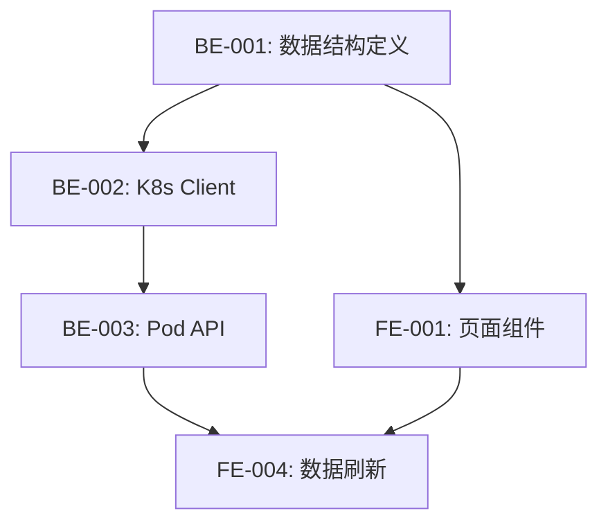

# 项目开发指南

> 本文档定义了项目的开发规范、流程和最佳实践，确保团队协作的一致性和代码质量。

---

## 目录

1. [技术栈规范](#1-技术栈规范)
2. [代码规范](#2-代码规范)
3. [测试规范](#3-测试规范)
4. [需求拆分流程](#4-需求拆分流程)
5. [上下文管理](#5-上下文管理)
6. [API 设计规范](#6-api-设计规范)
7. [前后端协作](#7-前后端协作)
8. [部署规范](#8-部署规范)

---

## 1. 技术栈规范

### 1.1 后端技术栈

| 技术 | 版本要求 | 说明 |
|------|---------|------|
| **Go** | 1.26.0 | 当前项目使用 Go 1.26.0 版本 |
| **K8s Client** | v0.35.2 | k8s.io/client-go 官方客户端库 |
| **数据库** | SQLite | 轻量级嵌入式数据库 |
| **ORM** | Prisma | 类型安全的数据库访问 |

### 1.2 前端技术栈

| 技术 | 版本要求 | 说明 |
|------|---------|------|
| **框架** | Next.js 16 | React 全栈框架 |
| **UI 库** | React 19 | 用户界面库 |
| **语言** | TypeScript 5 | 类型安全的 JavaScript 超集 |
| **样式** | Tailwind CSS | 原子化 CSS 框架 |

### 1.3 版本兼容性说明

```go
// go.mod 示例
module github.com/my-org/k8s-dashboard

go 1.22

require (
    k8s.io/client-go v0.35.2
    k8s.io/api v0.35.2
    k8s.io/apimachinery v0.35.2
)
```

```json
// package.json 示例
{
  "dependencies": {
    "next": "^16.0.0",
    "react": "^19.0.0",
    "react-dom": "^19.0.0",
    "typescript": "^5.0.0",
    "@prisma/client": "^5.0.0"
  }
}
```

---

## 2. 代码规范

### 2.1 函数命名规范

#### Go 命名规范

```go
// ✅ 正确：驼峰命名，导出函数首字母大写
func GetUserByID(id string) (*User, error) {
    // ...
}

// ✅ 正确：私有函数首字母小写
func validateUserData(user *User) error {
    // ...
}

// ✅ 正确：构造函数使用 New 前缀
func NewK8sClient(config *Config) (*K8sClient, error) {
    // ...
}

// ✅ 正确：接口命名使用 -er 后缀
type UserReader interface {
    Read(id string) (*User, error)
}

type PodManager interface {
    CreatePod(ctx context.Context, spec *PodSpec) error
    DeletePod(ctx context.Context, name string) error
    ListPods(ctx context.Context, namespace string) ([]Pod, error)
}

// ❌ 错误：下划线命名
func get_user_by_id(id string) {} // 不要这样写

// ❌ 错误：无意义的名称
func Process(data interface{}) {} // 太模糊
```

#### TypeScript/React 命名规范

```typescript
// ✅ 正确：组件使用 PascalCase
export function UserProfile({ userId }: UserProfileProps) {
  return <div>...</div>;
}

// ✅ 正确：自定义 Hook 使用 use 前缀
export function useK8sClient(namespace: string) {
  const [pods, setPods] = useState<Pod[]>([]);
  // ...
  return { pods, loading, error };
}

// ✅ 正确：工具函数使用 camelCase
export function formatPodStatus(status: PodStatus): string {
  return status.charAt(0).toUpperCase() + status.slice(1);
}

// ✅ 正确：常量使用 UPPER_SNAKE_CASE
export const MAX_RETRY_COUNT = 3;
export const DEFAULT_TIMEOUT_MS = 30000;

// ✅ 正确：类型/接口使用 PascalCase
interface PodSpec {
  name: string;
  namespace: string;
  containers: Container[];
}

type APIResponse<T> = {
  data: T;
  success: boolean;
  message: string;
};
```

### 2.2 错误处理规范

#### Go 错误处理

```go
import (
    "errors"
    "fmt"
)

// ✅ 正确：定义业务错误
var (
    ErrUserNotFound    = errors.New("user not found")
    ErrInvalidInput    = errors.New("invalid input")
    ErrUnauthorized    = errors.New("unauthorized access")
)

// ✅ 正确：错误包装
func (s *UserService) GetUser(ctx context.Context, id string) (*User, error) {
    user, err := s.repo.FindByID(ctx, id)
    if err != nil {
        if errors.Is(err, ErrUserNotFound) {
            return nil, fmt.Errorf("failed to get user %s: %w", id, err)
        }
        return nil, fmt.Errorf("database error: %w", err)
    }
    return user, nil
}

// ✅ 正确：自定义错误类型
type ValidationError struct {
    Field   string
    Message string
}

func (e *ValidationError) Error() string {
    return fmt.Sprintf("validation error: %s - %s", e.Field, e.Message)
}

// 使用自定义错误
func ValidateUser(user *User) error {
    if user.Name == "" {
        return &ValidationError{
            Field:   "name",
            Message: "name is required",
        }
    }
    return nil
}

// ❌ 错误：忽略错误
func badExample() {
    result, _ := doSomething() // 不要忽略错误
}

// ❌ 错误：panic 用于业务逻辑
func badPanicExample(id string) {
    if id == "" {
        panic("id is empty") // 不要在业务逻辑中使用 panic
    }
}
```

#### TypeScript 错误处理

```typescript
// ✅ 正确：定义业务错误类型
export class AppError extends Error {
  constructor(
    message: string,
    public code: string,
    public statusCode: number = 500
  ) {
    super(message);
    this.name = 'AppError';
  }
}

export class ValidationError extends AppError {
  constructor(
    public field: string,
    message: string
  ) {
    super(message, 'VALIDATION_ERROR', 400);
    this.name = 'ValidationError';
  }
}

export class NotFoundError extends AppError {
  constructor(resource: string) {
    super(`${resource} not found`, 'NOT_FOUND', 404);
    this.name = 'NotFoundError';
  }
}

// ✅ 正确：API 错误处理
export async function fetchPods(namespace: string): Promise<Pod[]> {
  try {
    const response = await fetch(`/api/pods?namespace=${namespace}`);
    
    if (!response.ok) {
      const error = await response.json();
      throw new AppError(
        error.message || 'Failed to fetch pods',
        error.code || 'API_ERROR',
        response.status
      );
    }
    
    return response.json();
  } catch (error) {
    if (error instanceof AppError) {
      throw error;
    }
    throw new AppError(
      'Network error while fetching pods',
      'NETWORK_ERROR',
      503
    );
  }
}

// ✅ 正确：React 组件中的错误处理
export function PodsList() {
  const { data, error, isLoading } = useQuery({
    queryKey: ['pods', namespace],
    queryFn: () => fetchPods(namespace),
    retry: 3,
    onError: (error) => {
      toast.error(error instanceof AppError ? error.message : 'Unknown error');
    },
  });

  if (error) {
    return <ErrorBoundary error={error} />;
  }

  return <PodTable pods={data} />;
}
```

### 2.3 日志规范

#### Go 日志规范

```go
import (
    "log/slog"
    "context"
)

// 使用结构化日志
var logger = slog.Default()

// ✅ 正确：结构化日志
func (s *UserService) CreateUser(ctx context.Context, req *CreateUserRequest) (*User, error) {
    logger.Info("creating user",
        slog.String("operation", "CreateUser"),
        slog.String("email", req.Email),
        slog.String("request_id", ctx.Value("request_id").(string)),
    )

    user, err := s.repo.Create(ctx, req)
    if err != nil {
        logger.Error("failed to create user",
            slog.String("operation", "CreateUser"),
            slog.String("email", req.Email),
            slog.String("error", err.Error()),
        )
        return nil, err
    }

    logger.Info("user created successfully",
        slog.String("operation", "CreateUser"),
        slog.String("user_id", user.ID),
    )
    return user, nil
}

// ❌ 错误：非结构化日志
func badLogExample() {
    log.Printf("Creating user %s", email) // 不要使用 printf 风格
}
```

#### 日志级别使用规范

| 级别 | 使用场景 |
|------|---------|
| DEBUG | 开发调试信息，生产环境不输出 |
| INFO | 正常业务流程日志 |
| WARN | 潜在问题，不影响业务运行 |
| ERROR | 错误信息，需要关注但不影响系统运行 |
| FATAL | 严重错误，程序需要退出 |

### 2.4 注释规范

#### Go 注释规范

```go
// Package userservice 提供用户相关的业务逻辑处理。
//
// 主要功能包括：
// - 用户创建、更新、删除
// - 用户认证和授权
// - 用户信息查询
package userservice

// UserService 管理用户相关的业务操作。
// 它封装了用户数据访问和业务逻辑，提供统一的服务接口。
type UserService struct {
    repo     UserRepository
    cache    CacheService
    notifier NotificationService
}

// CreateUser 创建新用户。
//
// 参数：
//   - ctx: 上下文，用于取消操作和传递追踪信息
//   - req: 用户创建请求，包含必要的用户信息
//
// 返回：
//   - *User: 创建成功的用户对象
//   - error: 如果创建失败，返回错误信息
//
// 错误类型：
//   - ErrInvalidInput: 输入参数无效
//   - ErrUserExists: 用户已存在
//
// 示例：
//
//  user, err := service.CreateUser(ctx, &CreateUserRequest{
//      Email:    "user@example.com",
//      Name:     "John Doe",
//      Password: "secure-password",
//  })
func (s *UserService) CreateUser(ctx context.Context, req *CreateUserRequest) (*User, error) {
    // 验证输入参数
    if err := s.validateRequest(req); err != nil {
        return nil, fmt.Errorf("validation failed: %w", err)
    }

    // 检查用户是否已存在
    exists, err := s.repo.ExistsByEmail(ctx, req.Email)
    if err != nil {
        return nil, fmt.Errorf("failed to check user existence: %w", err)
    }
    if exists {
        return nil, ErrUserExists
    }

    // 创建用户逻辑...
    return user, nil
}

// TODO(username): 在下一版本中添加用户头像上传功能
// FIXME: 这里的密码加密算法需要升级为 bcrypt
```

#### TypeScript 注释规范

```typescript
/**
 * 用户服务类，处理用户相关的业务逻辑
 * 
 * @example
 * ```typescript
 * const userService = new UserService(userRepository);
 * const user = await userService.createUser({
 *   email: 'user@example.com',
 *   name: 'John Doe',
 * });
 * ```
 */
export class UserService {
  /**
   * 创建新用户
   * 
   * @param request - 用户创建请求参数
   * @returns 创建的用户对象
   * @throws {ValidationError} 当输入参数无效时
   * @throws {ConflictError} 当用户已存在时
   */
  async createUser(request: CreateUserRequest): Promise<User> {
    // 验证输入
    if (!request.email || !request.name) {
      throw new ValidationError('email and name are required');
    }

    // 检查用户是否存在
    const existingUser = await this.userRepository.findByEmail(request.email);
    if (existingUser) {
      throw new ConflictError('User already exists');
    }

    // 创建用户...
  }
}

/**
 * Pod 状态类型定义
 * @see https://kubernetes.io/docs/concepts/workloads/pods/pod-lifecycle/#pod-phase
 */
export type PodPhase = 'Pending' | 'Running' | 'Succeeded' | 'Failed' | 'Unknown';

/**
 * 获取 Pod 的显示状态
 * 
 * @param pod - Pod 对象
 * @returns 格式化后的状态字符串
 */
export function getPodDisplayStatus(pod: Pod): string {
  if (pod.metadata.deletionTimestamp) {
    return 'Terminating';
  }
  return pod.status.phase;
}
```

---

## 3. 测试规范

### 3.1 单元测试要求

#### Go 单元测试

```go
package userservice_test

import (
    "context"
    "testing"
    "github.com/stretchr/testify/assert"
    "github.com/stretchr/testify/mock"
    "github.com/my-org/my-project/internal/service"
)

// 测试文件命名：xxx_test.go
// 测试函数命名：Test<函数名>_<测试场景>

// 使用 Mock 对象
type MockUserRepository struct {
    mock.Mock
}

func (m *MockUserRepository) FindByEmail(ctx context.Context, email string) (*User, error) {
    args := m.Called(ctx, email)
    if args.Get(0) == nil {
        return nil, args.Error(1)
    }
    return args.Get(0).(*User), args.Error(1)
}

// ✅ 正确：表驱动测试
func TestCreateUser(t *testing.T) {
    tests := []struct {
        name    string
        request *CreateUserRequest
        setup   func(*MockUserRepository)
        want    *User
        wantErr error
    }{
        {
            name: "success",
            request: &CreateUserRequest{
                Email:    "test@example.com",
                Name:     "Test User",
                Password: "password123",
            },
            setup: func(m *MockUserRepository) {
                m.On("FindByEmail", mock.Anything, "test@example.com").
                    Return(nil, nil)
                m.On("Create", mock.Anything, mock.Anything).
                    Return(&User{ID: "1", Email: "test@example.com"}, nil)
            },
            want:    &User{ID: "1", Email: "test@example.com"},
            wantErr: nil,
        },
        {
            name: "user already exists",
            request: &CreateUserRequest{
                Email:    "existing@example.com",
                Name:     "Existing User",
                Password: "password123",
            },
            setup: func(m *MockUserRepository) {
                m.On("FindByEmail", mock.Anything, "existing@example.com").
                    Return(&User{ID: "2"}, nil)
            },
            want:    nil,
            wantErr: ErrUserExists,
        },
        {
            name: "invalid email",
            request: &CreateUserRequest{
                Email:    "",
                Name:     "Test User",
                Password: "password123",
            },
            setup:   func(m *MockUserRepository) {},
            want:    nil,
            wantErr: ErrInvalidInput,
        },
    }

    for _, tt := range tests {
        t.Run(tt.name, func(t *testing.T) {
            // Arrange
            mockRepo := new(MockUserRepository)
            tt.setup(mockRepo)
            service := NewUserService(mockRepo)

            // Act
            got, err := service.CreateUser(context.Background(), tt.request)

            // Assert
            if tt.wantErr != nil {
                assert.ErrorIs(t, err, tt.wantErr)
                assert.Nil(t, got)
            } else {
                assert.NoError(t, err)
                assert.Equal(t, tt.want.Email, got.Email)
            }
            mockRepo.AssertExpectations(t)
        })
    }
}

// ✅ 正确：基准测试
func BenchmarkCreateUser(b *testing.B) {
    mockRepo := new(MockUserRepository)
    service := NewUserService(mockRepo)

    b.ResetTimer()
    for i := 0; i < b.N; i++ {
        service.CreateUser(context.Background(), &CreateUserRequest{
            Email:    "test@example.com",
            Name:     "Test User",
            Password: "password123",
        })
    }
}
```

#### 前端单元测试

```typescript
// __tests__/hooks/useK8sClient.test.ts
import { renderHook, waitFor } from '@testing-library/react';
import { QueryClient, QueryClientProvider } from '@tanstack/react-query';
import { useK8sClient } from '@/hooks/use-k8s';

// Mock fetch
global.fetch = jest.fn();

const createWrapper = () => {
  const queryClient = new QueryClient({
    defaultOptions: {
      queries: { retry: false },
    },
  });
  return ({ children }: { children: React.ReactNode }) => (
    <QueryClientProvider client={queryClient}>{children}</QueryClientProvider>
  );
};

describe('useK8sClient', () => {
  beforeEach(() => {
    jest.clearAllMocks();
  });

  describe('fetchPods', () => {
    it('should return pods on successful fetch', async () => {
      // Arrange
      const mockPods = [
        { name: 'pod-1', namespace: 'default', status: 'Running' },
        { name: 'pod-2', namespace: 'default', status: 'Pending' },
      ];
      (fetch as jest.Mock).mockResolvedValueOnce({
        ok: true,
        json: () => Promise.resolve(mockPods),
      });

      // Act
      const { result } = renderHook(() => useK8sClient('default'), {
        wrapper: createWrapper(),
      });

      // Assert
      await waitFor(() => {
        expect(result.current.pods).toEqual(mockPods);
        expect(result.current.isLoading).toBe(false);
        expect(result.current.error).toBeNull();
      });
    });

    it('should handle fetch error', async () => {
      // Arrange
      (fetch as jest.Mock).mockRejectedValueOnce(new Error('Network error'));

      // Act
      const { result } = renderHook(() => useK8sClient('default'), {
        wrapper: createWrapper(),
      });

      // Assert
      await waitFor(() => {
        expect(result.current.error).toBeInstanceOf(Error);
        expect(result.current.pods).toEqual([]);
      });
    });
  });
});
```

### 3.2 测试覆盖率要求

- **最低覆盖率**: 80%
- **核心业务逻辑**: 90%+
- **工具函数**: 100%

```bash
# Go 测试覆盖率
go test -coverprofile=coverage.out ./...
go tool cover -html=coverage.out -o coverage.html

# 前端测试覆盖率 (使用 vitest)
npm run test:coverage
```

### 3.3 测试文件命名规则

| 类型 | 文件命名 | 示例 |
|------|---------|------|
| Go 单元测试 | `xxx_test.go` | `user_service_test.go` |
| Go 基准测试 | `xxx_test.go` (同文件) | `BenchmarkCreateUser` |
| 前端单元测试 | `*.test.ts(x)` | `useK8sClient.test.ts` |
| 前端集成测试 | `*.spec.ts(x)` | `login.spec.ts` |
| E2E 测试 | `*.e2e.test.ts` | `user-flow.e2e.test.ts` |

### 3.4 Mock 和 Stub 使用规范

```go
// ✅ 正确：使用接口便于 Mock
type UserRepository interface {
    FindByID(ctx context.Context, id string) (*User, error)
    FindByEmail(ctx context.Context, email string) (*User, error)
    Create(ctx context.Context, user *User) error
    Update(ctx context.Context, user *User) error
    Delete(ctx context.Context, id string) error
}

// ✅ 正确：使用 testify/mock
type MockUserRepository struct {
    mock.Mock
}

func (m *MockUserRepository) FindByID(ctx context.Context, id string) (*User, error) {
    args := m.Called(ctx, id)
    return args.Get(0).(*User), args.Error(1)
}

// ✅ 正确：使用 Stub 进行简单测试
type StubUserRepository struct {
    Users map[string]*User
}

func (s *StubUserRepository) FindByID(ctx context.Context, id string) (*User, error) {
    user, ok := s.Users[id]
    if !ok {
        return nil, ErrUserNotFound
    }
    return user, nil
}
```

---

## 4. 需求拆分流程

### 4.1 需求拆分原则

```
EPIC (史诗)
  └── Feature (功能)
        └── User Story (用户故事)
              └── Task (任务)
```

### 4.2 需求拆分步骤

#### Step 1: 理解需求

```markdown
## 需求描述
作为一个 K8s 集群管理员，我希望能够在一个界面中查看所有 Pod 的状态，
以便快速识别和处理问题 Pod。

## 验收标准
- [ ] 显示 Pod 名称、命名空间、状态
- [ ] 支持按命名空间筛选
- [ ] 支持搜索 Pod 名称
- [ ] 实时刷新（WebSocket 或轮询）
- [ ] 响应式设计，支持移动端
```

#### Step 2: 拆分为功能模块

```markdown
## 功能拆分

### 1. 后端 API
- [ ] GET /api/pods - 获取 Pod 列表
- [ ] GET /api/pods/:name - 获取单个 Pod 详情
- [ ] WebSocket /api/pods/watch - 实时监控

### 2. 前端页面
- [ ] Pods 列表页面布局
- [ ] 命名空间选择器组件
- [ ] 搜索框组件
- [ ] Pod 状态标签组件
- [ ] 实时刷新逻辑

### 3. 数据模型
- [ ] Pod 数据类型定义
- [ ] API 响应类型定义
```

#### Step 3: 细化为具体任务

```markdown
## 任务列表

### 后端任务
- [ ] BE-001: 定义 Pod 数据结构和类型
- [ ] BE-002: 实现 K8s Client 封装
- [ ] BE-003: 实现 Pod 列表 API
- [ ] BE-004: 实现 WebSocket 监控
- [ ] BE-005: 编写单元测试

### 前端任务
- [ ] FE-001: 创建 Pod 列表页面组件
- [ ] FE-002: 实现命名空间选择器
- [ ] FE-003: 实现搜索功能
- [ ] FE-004: 实现实时数据刷新
- [ ] FE-005: 添加加载和错误状态
- [ ] FE-006: 编写前端测试
```

### 4.3 任务优先级定义

| 优先级 | 定义 | 示例 |
|--------|------|------|
| **P0** | 必须完成，阻塞其他功能 | Pod 列表 API、基础页面 |
| **P1** | 重要但非阻塞 | 命名空间筛选、搜索 |
| **P2** | 优化体验 | 实时刷新、动画效果 |
| **P3** | 锦上添花 | 深色模式、自定义列 |

### 4.4 任务依赖关系处理



```markdown
## 依赖管理

### 串行依赖
- BE-001 → BE-002 → BE-003 (必须按顺序执行)

### 并行执行
- BE-003 和 FE-001 可以并行（前端使用 Mock 数据）
- FE-002 和 FE-003 可以并行

### 阻塞关系
- FE-004 依赖 BE-003 完成
- 集成测试依赖所有任务完成
```

---

## 5. 上下文管理

### 5.1 代码上下文传递

#### Go Context 使用

```go
import (
    "context"
    "time"
)

// ✅ 正确：context 作为第一个参数
func (s *UserService) GetUser(ctx context.Context, id string) (*User, error) {
    // 传递 context 到下游调用
    user, err := s.repo.FindByID(ctx, id)
    if err != nil {
        return nil, err
    }

    // 检查 context 是否被取消
    select {
    case <-ctx.Done():
        return nil, ctx.Err()
    default:
    }

    return user, nil
}

// ✅ 正确：设置超时
func (s *UserService) GetUserWithTimeout(id string) (*User, error) {
    ctx, cancel := context.WithTimeout(context.Background(), 5*time.Second)
    defer cancel()
    
    return s.GetUser(ctx, id)
}

// ✅ 正确：传递追踪信息
type ctxKey string

const (
    RequestIDKey ctxKey = "request_id"
    UserIDKey    ctxKey = "user_id"
)

func WithRequestID(ctx context.Context, requestID string) context.Context {
    return context.WithValue(ctx, RequestIDKey, requestID)
}

func GetRequestID(ctx context.Context) string {
    if id, ok := ctx.Value(RequestIDKey).(string); ok {
        return id
    }
    return ""
}
```

### 5.2 文档上下文（worklog.md）使用规范

```markdown
# 开发日志 (worklog.md)

## 2024-01-15

### 完成的任务
- [x] BE-001: 实现 Pod 列表 API (#commit-hash)
- [x] FE-001: 创建 Pod 列表页面组件

### 进行中的任务
- [ ] BE-002: WebSocket 实时监控 (进度: 60%)

### 遇到的问题
1. **问题描述**: K8s Client 连接超时
   - **原因**: kubeconfig 路径配置错误
   - **解决方案**: 使用环境变量 KUBECONFIG 指定路径
   - **相关 Issue**: #42

### 代码变更说明
- `internal/k8s/client.go`: 添加连接池配置
- `internal/handlers/pods.go`: 新增 Pod 列表处理函数

### 下一步计划
1. 完成 WebSocket 监控功能
2. 添加 Pod 详情页面
3. 编写集成测试

---

## 2024-01-14

### 完成的任务
- [x] 项目初始化
- [x] 搭建基础框架

### 技术决策
- 选择 SQLite 作为数据库（轻量级、易部署）
- 使用 Prisma ORM（类型安全）
- 采用 Next.js 16 + React 19（最新稳定版）
```

### 5.3 Git 提交规范

#### Commit Message 格式

```
<type>(<scope>): <subject>

<body>

<footer>
```

#### Type 类型

| Type | 说明 | 示例 |
|------|------|------|
| `feat` | 新功能 | feat(pods): add pod list API |
| `fix` | Bug 修复 | fix(auth): correct token validation |
| `docs` | 文档更新 | docs: update API documentation |
| `style` | 代码格式（不影响功能） | style: format code with prettier |
| `refactor` | 代码重构 | refactor(user): extract validation logic |
| `test` | 测试相关 | test(pods): add unit tests for list API |
| `chore` | 构建/工具相关 | chore: update dependencies |
| `perf` | 性能优化 | perf(cache): improve cache hit rate |

#### 提交示例

```bash
# 功能开发
feat(pods): implement pod list API with filtering

- Add GET /api/pods endpoint
- Support namespace filtering
- Support search by pod name
- Add pagination support

Closes #123

# Bug 修复
fix(auth): prevent token expiration edge case

The token was expiring 1 second early due to timezone handling.

Fixes #456

# 重构
refactor(k8s): extract client configuration to separate module

Move K8s client configuration logic to internal/k8s/config.go
for better separation of concerns and testability.
```

#### 分支命名规范

```
feature/BE-001-pod-list-api    # 功能分支
bugfix/auth-token-expiry       # Bug 修复分支
hotfix/security-patch          # 紧急修复分支
release/v1.2.0                 # 发布分支
```

---

## 6. API 设计规范

### 6.1 RESTful API 设计

#### URL 设计规范

```
# ✅ 正确：使用名词复数
GET    /api/v1/pods                    # 获取 Pod 列表
GET    /api/v1/pods/{name}             # 获取单个 Pod
POST   /api/v1/pods                    # 创建 Pod
PUT    /api/v1/pods/{name}             # 更新 Pod
DELETE /api/v1/pods/{name}             # 删除 Pod

# ✅ 正确：嵌套资源
GET    /api/v1/namespaces/{ns}/pods    # 获取命名空间下的 Pod
GET    /api/v1/pods/{name}/logs        # 获取 Pod 日志

# ✅ 正确：动作使用动词
POST   /api/v1/pods/{name}/restart     # 重启 Pod
POST   /api/v1/pods/{name}/scale       # 扩缩容

# ❌ 错误：使用动词
GET    /api/v1/getPods                 # 不要这样设计
DELETE /api/v1/deletePod/{name}        # 不要这样设计
```

#### HTTP 方法使用

| 方法 | 用途 | 幂等性 | 示例 |
|------|------|--------|------|
| GET | 获取资源 | 是 | 获取 Pod 列表 |
| POST | 创建资源 | 否 | 创建新 Pod |
| PUT | 全量更新 | 是 | 更新 Pod 配置 |
| PATCH | 部分更新 | 是 | 更新 Pod 标签 |
| DELETE | 删除资源 | 是 | 删除 Pod |

### 6.2 错误响应格式

```json
// 标准错误响应格式
{
  "success": false,
  "error": {
    "code": "VALIDATION_ERROR",
    "message": "Invalid request parameters",
    "details": [
      {
        "field": "name",
        "message": "name is required"
      },
      {
        "field": "namespace",
        "message": "namespace must be a valid DNS label"
      }
    ]
  },
  "requestId": "req-abc123",
  "timestamp": "2024-01-15T10:30:00Z"
}
```

#### 错误码定义

| 错误码 | HTTP 状态码 | 说明 |
|--------|------------|------|
| `VALIDATION_ERROR` | 400 | 请求参数验证失败 |
| `UNAUTHORIZED` | 401 | 未认证 |
| `FORBIDDEN` | 403 | 无权限 |
| `NOT_FOUND` | 404 | 资源不存在 |
| `CONFLICT` | 409 | 资源冲突 |
| `RATE_LIMITED` | 429 | 请求频率限制 |
| `INTERNAL_ERROR` | 500 | 服务器内部错误 |
| `SERVICE_UNAVAILABLE` | 503 | 服务不可用 |

#### Go 实现

```go
// API 响应结构
type APIResponse struct {
    Success   bool        `json:"success"`
    Data      interface{} `json:"data,omitempty"`
    Error     *APIError   `json:"error,omitempty"`
    RequestID string      `json:"requestId"`
    Timestamp time.Time   `json:"timestamp"`
}

type APIError struct {
    Code    string        `json:"code"`
    Message string        `json:"message"`
    Details []ErrorDetail `json:"details,omitempty"`
}

type ErrorDetail struct {
    Field   string `json:"field"`
    Message string `json:"message"`
}

// 错误响应助手函数
func WriteError(w http.ResponseWriter, code string, message string, statusCode int, details []ErrorDetail) {
    resp := APIResponse{
        Success: false,
        Error: &APIError{
            Code:    code,
            Message: message,
            Details: details,
        },
        RequestID: getRequestID(r.Context()),
        Timestamp: time.Now(),
    }

    w.Header().Set("Content-Type", "application/json")
    w.WriteHeader(statusCode)
    json.NewEncoder(w).Encode(resp)
}

// 使用示例
func (h *PodHandler) CreatePod(w http.ResponseWriter, r *http.Request) {
    var req CreatePodRequest
    if err := json.NewDecoder(r.Body).Decode(&req); err != nil {
        WriteError(w, "VALIDATION_ERROR", "Invalid JSON body", http.StatusBadRequest, nil)
        return
    }

    if err := validateCreatePodRequest(&req); err != nil {
        WriteError(w, "VALIDATION_ERROR", "Validation failed", http.StatusBadRequest, err.Details)
        return
    }

    // ...
}
```

### 6.3 分页规范

```json
// 分页请求
GET /api/v1/pods?page=1&pageSize=20&namespace=default

// 分页响应
{
  "success": true,
  "data": {
    "items": [
      { "name": "pod-1", "namespace": "default", "status": "Running" },
      { "name": "pod-2", "namespace": "default", "status": "Pending" }
    ],
    "pagination": {
      "page": 1,
      "pageSize": 20,
      "total": 150,
      "totalPages": 8,
      "hasNext": true,
      "hasPrev": false
    }
  }
}
```

```go
// Go 分页结构
type Pagination struct {
    Page       int   `json:"page"`
    PageSize   int   `json:"pageSize"`
    Total      int64 `json:"total"`
    TotalPages int   `json:"totalPages"`
    HasNext    bool  `json:"hasNext"`
    HasPrev    bool  `json:"hasPrev"`
}

type PaginatedResponse struct {
    Items      interface{} `json:"items"`
    Pagination Pagination  `json:"pagination"`
}

// 分页参数解析
func ParsePagination(r *http.Request) (page, pageSize int) {
    page, _ = strconv.Atoi(r.URL.Query().Get("page"))
    if page < 1 {
        page = 1
    }

    pageSize, _ = strconv.Atoi(r.URL.Query().Get("pageSize"))
    if pageSize < 1 || pageSize > 100 {
        pageSize = 20 // 默认值
    }

    return page, pageSize
}
```

---

## 7. 前后端协作

### 7.1 API 接口定义

#### 使用 OpenAPI/Swagger 规范

```yaml
# openapi.yaml
openapi: 3.0.3
info:
  title: K8s Dashboard API
  version: 1.0.0
  description: Kubernetes Dashboard Management API

paths:
  /api/v1/pods:
    get:
      summary: List all pods
      tags:
        - Pods
      parameters:
        - name: namespace
          in: query
          schema:
            type: string
            default: default
        - name: page
          in: query
          schema:
            type: integer
            default: 1
        - name: pageSize
          in: query
          schema:
            type: integer
            default: 20
      responses:
        '200':
          description: Successful response
          content:
            application/json:
              schema:
                $ref: '#/components/schemas/PodListResponse'
        '400':
          description: Bad request
          content:
            application/json:
              schema:
                $ref: '#/components/schemas/ErrorResponse'

components:
  schemas:
    Pod:
      type: object
      properties:
        name:
          type: string
        namespace:
          type: string
        status:
          type: string
          enum: [Pending, Running, Succeeded, Failed, Unknown]
        containers:
          type: array
          items:
            $ref: '#/components/schemas/Container'

    Container:
      type: object
      properties:
        name:
          type: string
        image:
          type: string
        status:
          type: string

    PodListResponse:
      type: object
      properties:
        success:
          type: boolean
        data:
          type: object
          properties:
            items:
              type: array
              items:
                $ref: '#/components/schemas/Pod'
            pagination:
              $ref: '#/components/schemas/Pagination'

    Pagination:
      type: object
      properties:
        page:
          type: integer
        pageSize:
          type: integer
        total:
          type: integer
        totalPages:
          type: integer

    ErrorResponse:
      type: object
      properties:
        success:
          type: boolean
          example: false
        error:
          type: object
          properties:
            code:
              type: string
            message:
              type: string
            details:
              type: array
              items:
                type: object
                properties:
                  field:
                    type: string
                  message:
                    type: string
```

### 7.2 数据类型共享

#### 共享类型定义文件

```typescript
// shared/types/pod.ts

/**
 * Pod 状态枚举
 */
export type PodPhase = 'Pending' | 'Running' | 'Succeeded' | 'Failed' | 'Unknown';

/**
 * Pod 容器状态
 */
export interface ContainerStatus {
  name: string;
  image: string;
  status: 'Running' | 'Waiting' | 'Terminated';
  ready: boolean;
  restartCount: number;
}

/**
 * Pod 数据结构
 */
export interface Pod {
  name: string;
  namespace: string;
  status: PodPhase;
  containers: ContainerStatus[];
  labels: Record<string, string>;
  createdAt: string;
  nodeName: string;
  podIP: string;
}

/**
 * 分页信息
 */
export interface Pagination {
  page: number;
  pageSize: number;
  total: number;
  totalPages: number;
  hasNext: boolean;
  hasPrev: boolean;
}

/**
 * 分页响应
 */
export interface PaginatedResponse<T> {
  items: T[];
  pagination: Pagination;
}

/**
 * API 响应
 */
export interface APIResponse<T> {
  success: boolean;
  data?: T;
  error?: APIError;
  requestId: string;
  timestamp: string;
}

/**
 * API 错误
 */
export interface APIError {
  code: string;
  message: string;
  details?: ErrorDetail[];
}

export interface ErrorDetail {
  field: string;
  message: string;
}
```

#### Go 类型定义（保持同步）

```go
// internal/models/types.go

package models

import "time"

// PodPhase Pod 状态
type PodPhase string

const (
    PodPhasePending   PodPhase = "Pending"
    PodPhaseRunning   PodPhase = "Running"
    PodPhaseSucceeded PodPhase = "Succeeded"
    PodPhaseFailed    PodPhase = "Failed"
    PodPhaseUnknown   PodPhase = "Unknown"
)

// ContainerStatus 容器状态
type ContainerStatus struct {
    Name         string `json:"name"`
    Image        string `json:"image"`
    Status       string `json:"status"`
    Ready        bool   `json:"ready"`
    RestartCount int    `json:"restartCount"`
}

// Pod 数据结构
type Pod struct {
    Name       string            `json:"name"`
    Namespace  string            `json:"namespace"`
    Status     PodPhase          `json:"status"`
    Containers []ContainerStatus `json:"containers"`
    Labels     map[string]string `json:"labels"`
    CreatedAt  time.Time         `json:"createdAt"`
    NodeName   string            `json:"nodeName"`
    PodIP      string            `json:"podIP"`
}

// Pagination 分页信息
type Pagination struct {
    Page       int   `json:"page"`
    PageSize   int   `json:"pageSize"`
    Total      int64 `json:"total"`
    TotalPages int   `json:"totalPages"`
    HasNext    bool  `json:"hasNext"`
    HasPrev    bool  `json:"hasPrev"`
}

// PaginatedResponse 分页响应
type PaginatedResponse struct {
    Items      interface{} `json:"items"`
    Pagination Pagination  `json:"pagination"`
}
```

### 7.3 错误码定义

```typescript
// shared/errors/codes.ts

/**
 * 错误码常量定义
 * 前后端共享，确保一致性
 */
export const ErrorCodes = {
  // 客户端错误 4xx
  VALIDATION_ERROR: 'VALIDATION_ERROR',
  UNAUTHORIZED: 'UNAUTHORIZED',
  FORBIDDEN: 'FORBIDDEN',
  NOT_FOUND: 'NOT_FOUND',
  CONFLICT: 'CONFLICT',
  
  // 资源相关
  RESOURCE_NOT_FOUND: 'RESOURCE_NOT_FOUND',
  RESOURCE_ALREADY_EXISTS: 'RESOURCE_ALREADY_EXISTS',
  
  // K8s 相关
  K8S_CONNECTION_ERROR: 'K8S_CONNECTION_ERROR',
  K8S_RESOURCE_INVALID: 'K8S_RESOURCE_INVALID',
  K8S_PERMISSION_DENIED: 'K8S_PERMISSION_DENIED',
  
  // 服务端错误 5xx
  INTERNAL_ERROR: 'INTERNAL_ERROR',
  SERVICE_UNAVAILABLE: 'SERVICE_UNAVAILABLE',
  RATE_LIMITED: 'RATE_LIMITED',
} as const;

export type ErrorCode = typeof ErrorCodes[keyof typeof ErrorCodes];

/**
 * 错误码到 HTTP 状态码的映射
 */
export const ErrorCodeToStatus: Record<ErrorCode, number> = {
  VALIDATION_ERROR: 400,
  UNAUTHORIZED: 401,
  FORBIDDEN: 403,
  NOT_FOUND: 404,
  CONFLICT: 409,
  RESOURCE_NOT_FOUND: 404,
  RESOURCE_ALREADY_EXISTS: 409,
  K8S_CONNECTION_ERROR: 503,
  K8S_RESOURCE_INVALID: 400,
  K8S_PERMISSION_DENIED: 403,
  INTERNAL_ERROR: 500,
  SERVICE_UNAVAILABLE: 503,
  RATE_LIMITED: 429,
};

/**
 * 错误码到用户友好消息的映射
 */
export const ErrorMessageMap: Record<ErrorCode, string> = {
  VALIDATION_ERROR: '请求参数验证失败',
  UNAUTHORIZED: '请先登录',
  FORBIDDEN: '没有权限执行此操作',
  NOT_FOUND: '请求的资源不存在',
  CONFLICT: '资源冲突',
  RESOURCE_NOT_FOUND: '资源不存在',
  RESOURCE_ALREADY_EXISTS: '资源已存在',
  K8S_CONNECTION_ERROR: '无法连接到 Kubernetes 集群',
  K8S_RESOURCE_INVALID: 'Kubernetes 资源配置无效',
  K8S_PERMISSION_DENIED: '没有 Kubernetes 操作权限',
  INTERNAL_ERROR: '服务器内部错误',
  SERVICE_UNAVAILABLE: '服务暂时不可用',
  RATE_LIMITED: '请求过于频繁，请稍后重试',
};
```

---

## 8. 部署规范

### 8.1 环境变量管理

#### 环境变量命名规范

```bash
# 格式: <SERVICE>_<CATEGORY>_<NAME>

# 数据库配置
DATABASE_URL="file:./dev.db"
DATABASE_POOL_SIZE=10

# K8s 配置
K8S_KUBECONFIG="/path/to/kubeconfig"
K8S_CONTEXT="default"
K8S_NAMESPACE="default"

# 服务配置
SERVER_PORT=3000
SERVER_HOST="0.0.0.0"
SERVER_ENV="development"  # development | staging | production

# 日志配置
LOG_LEVEL="info"  # debug | info | warn | error
LOG_FORMAT="json" # json | text

# 安全配置
JWT_SECRET="your-secret-key"
JWT_EXPIRY="24h"
```

#### 环境配置文件

```bash
# .env.example (提交到版本控制)
DATABASE_URL="file:./dev.db"
K8S_KUBECONFIG=""
K8S_CONTEXT="default"
SERVER_PORT=3000
LOG_LEVEL="info"
JWT_SECRET=""

# .env.development (本地开发)
DATABASE_URL="file:./dev.db"
LOG_LEVEL="debug"
SERVER_ENV="development"

# .env.production (生产环境，不提交)
DATABASE_URL="file:./prod.db"
LOG_LEVEL="info"
SERVER_ENV="production"
JWT_SECRET="production-secret-key"
```

#### Go 配置加载

```go
// internal/config/config.go

package config

import (
    "os"
    "strconv"
    "time"
)

type Config struct {
    Database DatabaseConfig
    K8s      K8sConfig
    Server   ServerConfig
    Log      LogConfig
    JWT      JWTConfig
}

type DatabaseConfig struct {
    URL      string
    PoolSize int
}

type K8sConfig struct {
    Kubeconfig string
    Context    string
    Namespace  string
}

type ServerConfig struct {
    Port int
    Host string
    Env  string
}

type LogConfig struct {
    Level  string
    Format string
}

type JWTConfig struct {
    Secret string
    Expiry time.Duration
}

func Load() *Config {
    return &Config{
        Database: DatabaseConfig{
            URL:      getEnv("DATABASE_URL", "file:./dev.db"),
            PoolSize: getEnvInt("DATABASE_POOL_SIZE", 10),
        },
        K8s: K8sConfig{
            Kubeconfig: getEnv("K8S_KUBECONFIG", ""),
            Context:    getEnv("K8S_CONTEXT", "default"),
            Namespace:  getEnv("K8S_NAMESPACE", "default"),
        },
        Server: ServerConfig{
            Port: getEnvInt("SERVER_PORT", 3000),
            Host: getEnv("SERVER_HOST", "0.0.0.0"),
            Env:  getEnv("SERVER_ENV", "development"),
        },
        Log: LogConfig{
            Level:  getEnv("LOG_LEVEL", "info"),
            Format: getEnv("LOG_FORMAT", "json"),
        },
        JWT: JWTConfig{
            Secret: getEnv("JWT_SECRET", ""),
            Expiry: getEnvDuration("JWT_EXPIRY", 24*time.Hour),
        },
    }
}

func getEnv(key, defaultValue string) string {
    if value := os.Getenv(key); value != "" {
        return value
    }
    return defaultValue
}

func getEnvInt(key string, defaultValue int) int {
    if value := os.Getenv(key); value != "" {
        if i, err := strconv.Atoi(value); err == nil {
            return i
        }
    }
    return defaultValue
}

func getEnvDuration(key string, defaultValue time.Duration) time.Duration {
    if value := os.Getenv(key); value != "" {
        if d, err := time.ParseDuration(value); err == nil {
            return d
        }
    }
    return defaultValue
}
```

### 8.2 配置文件管理

#### 项目配置目录结构

```
config/
├── default.yaml          # 默认配置
├── development.yaml      # 开发环境配置
├── staging.yaml          # 预发环境配置
├── production.yaml       # 生产环境配置
└── README.md             # 配置说明文档
```

#### 配置文件示例

```yaml
# config/default.yaml
app:
  name: "k8s-dashboard"
  version: "1.0.0"

server:
  host: "0.0.0.0"
  port: 3000
  read_timeout: 30s
  write_timeout: 30s

database:
  url: "file:./dev.db"
  pool_size: 10
  max_idle_conns: 5

k8s:
  kubeconfig: ""
  context: "default"
  namespace: "default"
  qps: 100
  burst: 200

logging:
  level: "info"
  format: "json"
  output: "stdout"

---
# config/production.yaml
server:
  port: 8080

database:
  pool_size: 50
  max_idle_conns: 20

logging:
  level: "warn"

k8s:
  qps: 500
  burst: 1000
```

### 8.3 容器化规范

#### Dockerfile 最佳实践

```dockerfile
# 后端 Dockerfile (Go)
# syntax=docker/dockerfile:1

# 构建阶段
FROM golang:1.22-alpine AS builder

WORKDIR /app

# 依赖缓存层
COPY go.mod go.sum ./
RUN go mod download

# 构建
COPY . .
RUN CGO_ENABLED=0 GOOS=linux go build -ldflags="-s -w" -o /server ./cmd/server

# 运行阶段
FROM alpine:3.19

# 安全：非 root 用户
RUN addgroup -g 1000 appgroup && \
    adduser -u 1000 -G appgroup -D appuser

WORKDIR /app

# 安装 ca-certificates（HTTPS 请求需要）
RUN apk --no-cache add ca-certificates tzdata

# 复制二进制文件
COPY --from=builder /server .

# 设置时区
ENV TZ=Asia/Shanghai

# 切换用户
USER appuser

EXPOSE 8080

HEALTHCHECK --interval=30s --timeout=3s \
    CMD wget -q --spider http://localhost:8080/health || exit 1

ENTRYPOINT ["/server"]
```

```dockerfile
# 前端 Dockerfile (Next.js)
# syntax=docker/dockerfile:1

# 依赖阶段
FROM node:20-alpine AS deps

WORKDIR /app

COPY package.json package-lock.json* ./
RUN npm ci

# 构建阶段
FROM node:20-alpine AS builder

WORKDIR /app

COPY --from=deps /app/node_modules ./node_modules
COPY . .

ENV NEXT_TELEMETRY_DISABLED=1

RUN npm run build

# 运行阶段
FROM node:20-alpine AS runner

WORKDIR /app

ENV NODE_ENV=production
ENV NEXT_TELEMETRY_DISABLED=1

# 安全：非 root 用户
RUN addgroup -g 1000 nodejs && \
    adduser -u 1000 -G nodejs -D nextjs

COPY --from=builder /app/public ./public
COPY --from=builder --chown=nextjs:nodejs /app/.next/standalone ./
COPY --from=builder --chown=nextjs:nodejs /app/.next/static ./.next/static

USER nextjs

EXPOSE 3000

ENV PORT=3000
ENV HOSTNAME="0.0.0.0"

HEALTHCHECK --interval=30s --timeout=3s \
    CMD wget -q --spider http://localhost:3000/api/health || exit 1

CMD ["node", "server.js"]
```

#### Docker Compose 开发环境

```yaml
# docker-compose.yml
version: '3.8'

services:
  frontend:
    build:
      context: .
      dockerfile: Dockerfile
      target: runner
    ports:
      - "3000:3000"
    environment:
      - NODE_ENV=development
      - DATABASE_URL=file:/app/data/dev.db
    volumes:
      - ./data:/app/data
    healthcheck:
      test: ["CMD", "wget", "-q", "--spider", "http://localhost:3000/api/health"]
      interval: 30s
      timeout: 3s
      retries: 3

  backend:
    build:
      context: ./mini-services/k8s-service
      dockerfile: Dockerfile
    ports:
      - "8080:8080"
    environment:
      - SERVER_PORT=8080
      - LOG_LEVEL=debug
      - K8S_KUBECONFIG=/app/kubeconfig
    volumes:
      - ~/.kube/config:/app/kubeconfig:ro
    depends_on:
      - frontend

  # 可选：本地 K8s 集群
  kind:
    image: kindest/node:v1.28.0
    privileged: true
    ports:
      - "6443:6443"
```

#### Kubernetes 部署配置

```yaml
# k8s/deployment.yaml
apiVersion: apps/v1
kind: Deployment
metadata:
  name: k8s-dashboard
  namespace: k8s-dashboard
  labels:
    app: k8s-dashboard
spec:
  replicas: 3
  selector:
    matchLabels:
      app: k8s-dashboard
  template:
    metadata:
      labels:
        app: k8s-dashboard
    spec:
      serviceAccountName: k8s-dashboard
      containers:
        - name: frontend
          image: k8s-dashboard:latest
          ports:
            - containerPort: 3000
          env:
            - name: NODE_ENV
              value: "production"
          resources:
            requests:
              cpu: 100m
              memory: 128Mi
            limits:
              cpu: 500m
              memory: 512Mi
          livenessProbe:
            httpGet:
              path: /api/health
              port: 3000
            initialDelaySeconds: 10
            periodSeconds: 30
          readinessProbe:
            httpGet:
              path: /api/ready
              port: 3000
            initialDelaySeconds: 5
            periodSeconds: 10
          securityContext:
            runAsNonRoot: true
            runAsUser: 1000
            readOnlyRootFilesystem: true
            allowPrivilegeEscalation: false
---
apiVersion: v1
kind: Service
metadata:
  name: k8s-dashboard
  namespace: k8s-dashboard
spec:
  selector:
    app: k8s-dashboard
  ports:
    - port: 80
      targetPort: 3000
  type: ClusterIP
---
apiVersion: networking.k8s.io/v1
kind: Ingress
metadata:
  name: k8s-dashboard
  namespace: k8s-dashboard
  annotations:
    nginx.ingress.kubernetes.io/ssl-redirect: "true"
spec:
  ingressClassName: nginx
  rules:
    - host: dashboard.example.com
      http:
        paths:
          - path: /
            pathType: Prefix
            backend:
              service:
                name: k8s-dashboard
                port:
                  number: 80
```

---

## 附录

### A. 代码检查工具

```yaml
# .golangci.yml
linters:
  enable:
    - gofmt
    - goimports
    - govet
    - errcheck
    - staticcheck
    - ineffassign
    - typecheck
    - gosimple
    - goconst
    - gocyclo
    - dupl

linters-settings:
  gocyclo:
    min-complexity: 15
  goconst:
    min-len: 3
    min-occurrences: 3

run:
  timeout: 5m
  skip-dirs:
    - vendor
    - testdata
```

```json
// .eslintrc.json
{
  "extends": [
    "next/core-web-vitals",
    "plugin:@typescript-eslint/recommended"
  ],
  "rules": {
    "@typescript-eslint/no-unused-vars": "error",
    "@typescript-eslint/no-explicit-any": "warn",
    "prefer-const": "error",
    "no-console": ["warn", { "allow": ["warn", "error"] }]
  }
}
```

### B. Git Hooks

```bash
#!/bin/bash
# .husky/pre-commit

# Go 代码检查
golangci-lint run ./...

# 前端代码检查
npm run lint

# 运行测试
go test ./... -short
npm run test -- --passWithNoTests
```

### C. 参考资源

- [Go 代码规范](https://go.dev/doc/effective_go)
- [TypeScript 最佳实践](https://www.typescriptlang.org/docs/handbook/declaration-files/do-s-and-don-ts.html)
- [Kubernetes API 约定](https://github.com/kubernetes/community/blob/master/contributors/devel/sig-architecture/api-conventions.md)
- [Next.js 文档](https://nextjs.org/docs)
- [Prisma 文档](https://www.prisma.io/docs)

---

*最后更新: 2024-01-15*
